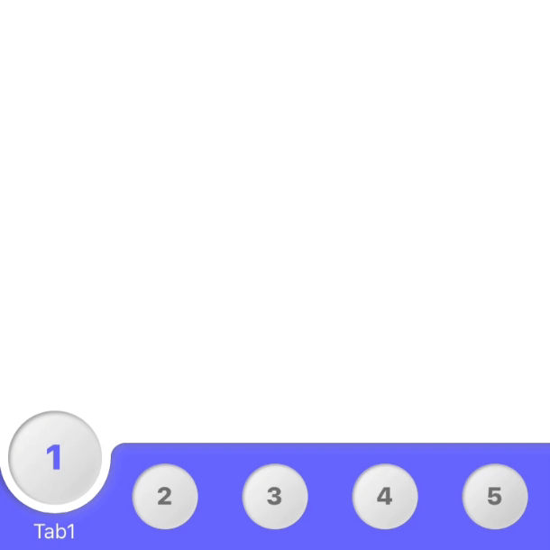
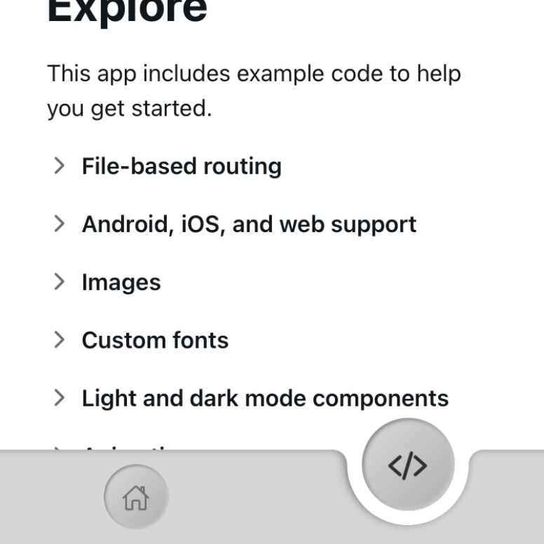

# Neumorphic Tab

[](https://www.npmjs.com/package/neumorphic-tab) [](https://www.npmjs.com/package/neumorphic-tab) [](https://www.npmjs.com/package/neumorphic-tab) [](https://expo.io/)

A react native bottom tab with a neumorphic style.





## Installation

### Dependencies

This library needs these dependencies to be installed in your project before you can use it:

```bash
npx expo install react-native-reanimated @shopify/react-native-skia react-native-redash
```

Using Expo?

```bash
npm install react-native-reanimated react-native-gesture-handler @shopify/react-native-skia
```

## Features 
              
- Compatible with `Reanimated` v3.
- Compatible with `Skia`.
- Compatible with `Expo`.
- Compatible with `react-native-navigation`
- Compatible with `expo-router`
- Accessibility support.
- Written in `TypeScript`.


## Props

### tabs

```required```

An array which contains objects with:

- key: ```string``` unique key
- Label: ```string | ({color,focused}) => ReactNode```
- Icon: ```({color}) => ReactNode```
- onPress: ```()=>void``` executed when pressed

### selected

```required``` if not using ```convertNavigationProps```.

### simplify

```optional```

type: ```boolean```

Deactivates border shadows in the tab, it could be use for low end devices.

### invert

```optional```

type: ```boolean```

Makes the tab's background to wrapped the item when selected. 

### tabBarColor

```optional```

type: ```string```

### itemColor

```optional```

type: ```string```

### focusedColor

```optional```

type: ```string```

### buttonPadding

```optional```

type: ```number```

### radiusGap

```optional```

type: ```number```

Defines the space between the icon item and its background.

### labelGap

```optional```

type: ```number```

Defines the space between the icon item and the label.

### buttonUnselectedScale

```optional```

type: ```number```

Defines how much the item will shrink when unfocus.

## Usage

### Standalone usage

```JSX
import { TabBar } from "neumorphic-tab";
import { useState } from "react";
import { StyleSheet, Text, View } from "react-native";

export default function App() {
  const [tabSelected, setTabSelected] = useState(0);

  const onSelectTab = (tab) => {
    // do stuff
    setTabSelected(tab);
  };

  return (
    <View style={styles.container}>
      <TabBar
        tabBarColor="#6666ff"
        itemColor="#ffffff"
        focusedColor="#6666ff"
        textColor="#ffffff"
        selected={tabSelected}
        buttonPadding={14}
        radiusGap={6}
        labelGap={12}
        buttonUnselectedScale={0.7}
        tabs={[
          {
            key:'1',
            Label: ({ color }) => <Text style={{ color }}>Tab1</Text>,
            Icon: ({ color }) => (
              <Text style={{ color, fontSize: 24, fontWeight: "800" }}>1</Text>
            ),
            onPress: () => onSelectTab(0),
          },
          {
            key:'2',
            Label: ({ color }) => <Text style={{ color }}>Tab2</Text>,
            Icon: ({ color }) => (
              <Text style={{ color, fontSize: 24, fontWeight: "800" }}>2</Text>
            ),
            onPress: () => onSelectTab(1),
          },
          {
            key:'3',
            Label: ({ color }) => <Text style={{ color }}>Tab3</Text>,
            Icon: ({ color }) => (
              <Text style={{ color, fontSize: 24, fontWeight: "800" }}>3</Text>
            ),
            onPress: () => onSelectTab(2),
          },
          {
            key:'4',
            Label: ({ color }) => <Text style={{ color }}>Tab4</Text>,
            Icon: ({ color }) => (
              <Text style={{ color, fontSize: 24, fontWeight: "800" }}>4</Text>
            ),
            onPress: () => onSelectTab(3),
          },
          {
            key:'5',
            Label: ({ color }) => <Text style={{ color }}>Tab5</Text>,
            Icon: ({ color }) => (
              <Text style={{ color, fontSize: 24, fontWeight: "800" }}>5</Text>
            ),
            onPress: () => onSelectTab(4),
          },
        ]}
      />
    </View>
  );
}


const styles = StyleSheet.create({
  container: {
    flex: 1,
    backgroundColor: "#fff",
    alignItems: "center",
    justifyContent: "center",
  },
});

```


### Using react-native-navigation

```JSX

import { TabBar, convertNavigationProps } from "neumorphic-tab";

...

 <Tab.Navigator
        

          // The TabBar component is mean to be used in this property, there you can customize as you want
          tabBar={(props) => (
            <TabBar
              invert
              
              // convertNavigationProps is a function used to adapt this library with the navigation props. 
              {...convertNavigationProps(props)}
              
              // The properties below are optional, there are default values.
              itemColor={theme.colors.primary}
              focusedColor={theme.colors.onBackground}
              unfocusedColor={theme.colors.onSurfaceDisabled}
              textColor={theme.colors.onBackground}
              tabBarColor={theme.colors.backgroundSecondary}
            />
          )}
        >
          <Tab.Screen
            name="Pomodoro"
            component={PomodoroScreen}
            options={{
              tabBarLabel: ({ focused, color }) => (
                <Text variant="titleMedium" style={{ color }}>
                  Pomodoro
                </Text>
              ),
              tabBarIcon: ({ focused, color, size }) => (
                <MaterialCommunityIcons
                  size={size}
                  name="timer"
                  color={color}
                  focused={focused}
                />
              ),
            }}
          />

          ...

        </Tab.Navigator>

```

### Using expo-router

As expo-router is based in react-navigation the code is the same


```JSX
Example expo 51 app 

./src/_layout.tsx


import { Tabs } from 'expo-router';
import React from 'react';

import { TabBarIcon } from '@/components/navigation/TabBarIcon';
import { Colors } from '@/constants/Colors';
import { useColorScheme } from '@/hooks/useColorScheme';

// This line is need to be added
import { TabBar , convertNavigationProps} from 'neumorphic-tab';

export default function TabLayout() {
  const colorScheme = useColorScheme();

  return (
    <Tabs
      // These lines are need to be added
      tabBar={(props)=>{
        return <TabBar 
        {...convertNavigationProps(props)}
        // Customization props could be added here
        />}}
      screenOptions={{
        tabBarActiveTintColor: Colors[colorScheme ?? 'light'].tint,
        headerShown: false,
      }}>
      <Tabs.Screen
        name="index"
        options={{
          title: 'Home',
          tabBarIcon: ({ color, focused }) => (
            <TabBarIcon name={focused ? 'home' : 'home-outline'} color={color} />
          ),
        }}
      />
      <Tabs.Screen
        name="explore"
        options={{
          title: 'Explore',
          tabBarIcon: ({ color, focused }) => (
            <TabBarIcon name={focused ? 'code-slash' : 'code-slash-outline'} color={color} />
          ),
        }}
      />
    </Tabs>
  );
}
```


## Author

- [Matias Veitch](https://matiasveitch.com.ar/)

## Inspiration

- Inspired by [neumorphism.io](https://neumorphis.io) 
- This library uses skia and it was made by trying skia features.

## License

[MIT](./LICENSE)